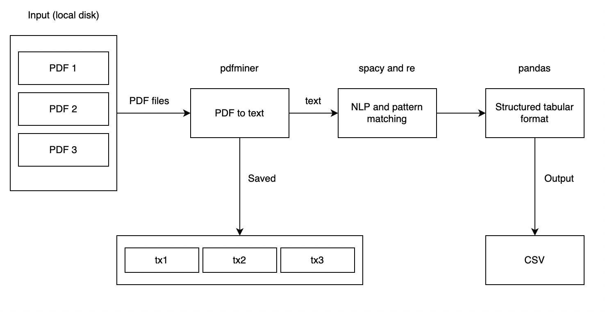

# Automated Resume Parser
Extracting names, phones, emails from CVs

## Description
- This tool is used to collect the main components from CVs (like names, phones, emails, etc) for managers so that they can easily get an overview of the applicants' ability
- Understanding basics of regular expression and natural language processing

## Project architecture

## Installation
Open a terminal, type this command and press enter

`pip install -r /path/to/requirements.txt`

## Libraries
1. pdfminer - pdf to text
2. spacy - NLP
3. re - regex
4. os - file path
5. pandas - output csv

Note: 
- Frequently used regex methods: `match, search, findall, split, sub, compile`
- This project only uses PDF files because other types of format can be easily converted into the PDF one
